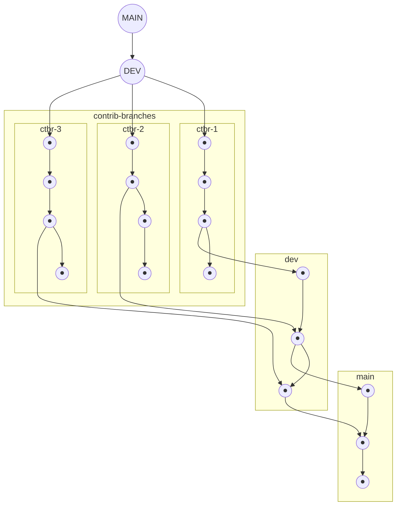
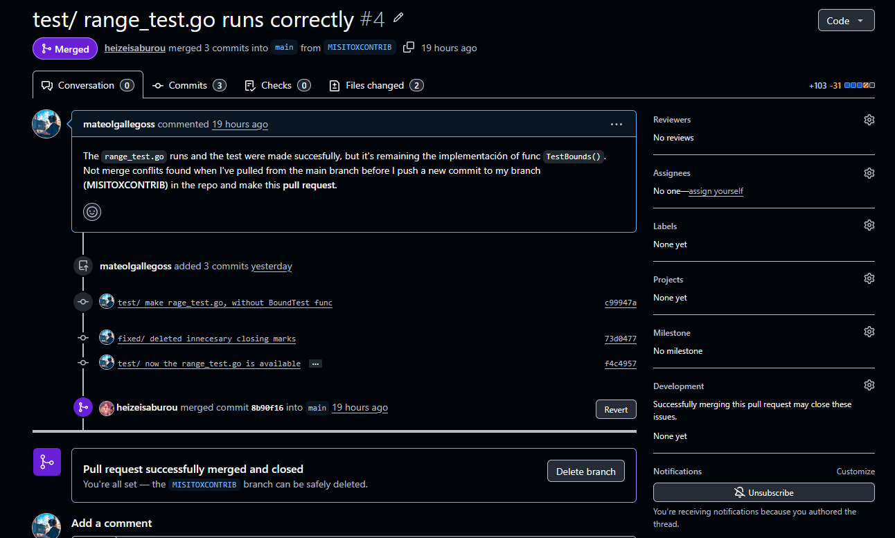

# Guía de contribución

Esta guía de contribución contiene las especificaciones para el uso de **Git**. Incluye en detalle el flujo de trabajo que se maneja, la función de las ramas y el uso de comandos.

Además, se incluye una guía para el manejo de la documentación del proyecto.

## Índice

- [1. Configuración del directorio local](#1-configuración-del-espacio-de-trabajo)
  - Configuración del entorno local y recomendación del manejo de una cuenta de git.
- [2. Ramas del proyecto](#2-ramas-del-proyecto)
  - Explicación de la función de cada rama y una breve intoducción al manejo de elas.
- [3. Flujo de trabajo diario](#3-flujo-de-trabajo-diario)
  - Los comandos y el flujo de trabajo que maneja cada contribuidor y el grupo en general, siendo un flujo rápido, limpio y sin agujeros.
- [4. Resolver un conflicto de merge](#4-resolver-un-conflicto-de-merge)
  - Se detalla como resolver un conflicto al hacer merge entre commits (commit antiguo --> rama stage y commit actual --> rama actual), solo se involucra stage y una rama dev, nunca se involucra main.
- [5. Nomenclatura de commits y rama](#5-nomenclatura-de-commits-y-ramas)
  - La nomenclatura a manejar para los títulos de ramas y commits
- [6. Documentación del proyecto](#6-documentación-del-proyecto)

---

## 1. Configuración del espacio de trabajo

La integración de githooks conlleva ciertas configuraciones que deben ejecutarse por detrás para garantizar un espacio de trabajo funcional. Aquí se explica cómo hacer estos ajustes después de clonar el repositorio.

La falta de estas configuraciones no rompen el proyecto, más no garantiza su correcto funcionamiento; y después de un tiempo, sin avisar verá como aparecen fallos.

Tener una cuenta de Git correctamente configurada es esencial. **Está prohibido cambiar el correo electrónico o el usuario de la configuración global de Git** para cualquiera de los espacios de trabajo utilizados con el repositorio (laptop, desktop, PC, VM, Sandbox, directorio, workspace, environment, etc.).

Para evitar estos problemas, se recomienda utilizar una **configuración local**, de modo que la cuenta de Git pueda configurarse específicamente para cada repositorio o espacio de trabajo.

### Configurar cuenta de Git

> [!TIP]
>
> Si configuras una cuenta de Git a nivel local, esta tendrá prioridad sobre las configuraciones globales y de sistema.
>
> **Prioridad:** `local > global > system`

### Configuración local — recomendada

**Usuario:**

```bash
git config user.name "kebab-case"
```

**Correo:**

```bash
git config user.email "user@gmail.com"
```

### Configuración global

> [!WARNING]
>
> No se recomienda utilizar esta configuración para este proyecto, ya que puede afectar a otros repositorios.

**Usuario:**

```bash
git config --global user.name "kebab-case"
```

**Correo:**

```bash
git config --global user.email "user@gmail.com"
```

### Configurar el clon

1. Clonar el repositorio dentro de un directorio:

   ```bash
   mkdir templateX
   cd teplateX
   ```

   Luego:

   ```bash
   git init
   git remote add origin https://github.com/heizeisaburou/templatex.git
   ```

2. Activar los hooks

   ```bash
   git config core.hooksPath .githooks
   ```

   .githooks contiene el hook [pre-push](.githooks/pre-push), encargado de validar el nombre de la rama antes de subirla. Se puede omitir con el atributo --no-verify, pero aún así la rama no pasa la validación del Pull Request.

   > [!NOTE]
   >
   > Para Windows funciona igual, ya que Git incluye su propio entorno POSIX para el SO.
   > El repositorio incluye un `.gitattributes` **(se superpone sobre la configuración local del clon)** que fuerza LF (lline field) en los scripts --> **Ver en [.gitattributes](.gitattributes)**.

3. Limpiar las referencias de ramas borradas

   Finalmente, ejecute el comando:

   ```bash
   git config --global fetch.prune true
   ```

   Se encarga de que, al fusionar un Pull Request, la rama desaparezca del servidor, con el clon conservando su referencia de seguimiento `(origin/rama)`. Va acumulando archivos dentro de `.git/refs/remotes/` y `.git/logs/refs/remotes/`.

   Ahora, cada `fetch` y `pull` eliminan por su cuenta las referencias cuya rama ya no existe en el servidor.

---

## 2. Ramas del proyecto

Para garantizar la integridad del proyecto, se han creado dos ramas principales de trabajo, a las que se suman las ramas de los contribuidores.

Trabajar con varias ramas en Git puede parecer complicado. Sin embargo, siguiendo correctamente las normas establecidas, se garantiza que, incluso si se acepta un Pull Request innecesario, exista una rama previa a `main` que permita revisar o revertir los cambios.



### `main`

La rama `main` contiene el código considerado estable del proyecto.

No se debe trabajar directamente sobre esta rama.

### `dev`

La rama `dev` funciona como puente entre las ramas de desarrollo y `main`.

Su objetivo es proporcionar una rama previa a `main` donde se puedan revisar y validar los cambios antes de incorporarlos a la rama principal.

Los cambios provenientes de una rama de desarrollo deben llegar a `dev` mediante un **Pull Request**.

Una vez que los cambios hayan sido revisados y aprobados por los miembros del proyecto, `dev` podrá incorporarse a `main` mediante otro **Pull Request**.

> [!WARNING]
>
> Está prohibido enviar un Pull Request directamente desde una rama de desarrollo hacia `main` o realizar `push` directamente sobre `main`, incluso si se es el propietario del repositorio.
>
> El incumplimiento de esta norma será sancionado de acuerdo con las reglas del proyecto **EXPUESTAS EN JIRA**.

### Ramas de desarrollo

Las ramas de desarrollo se utilizan para implementar cambios específicos.

Cada contribuidor debe trabajar sobre su propia rama de desarrollo y seguir la nomenclatura establecida en esta guía.

> [!IMPORTANT]
>
> Se debe mantener una única rama de desarrollo activa por contribuidor para evitar problemas de sincronización con `dev`.

---

## 3. Flujo de trabajo diario

Los conflictos de merge pueden aparecer durante el desarrollo, especialmente cuando varios contribuidores modifican partes relacionadas del proyecto. Un flujo de trabajo ordenado ayuda a reducir su aparición y facilita su resolución.

### 1. Actualizar las ramas locales

Antes de comenzar a trabajar, actualiza las ramas `main` y `dev` respecto al repositorio remoto:

```bash
git switch main
git pull origin main

git switch dev
git pull origin dev
```

### 2. Crear una rama de desarrollo

Crea una nueva rama a partir de `dev` y cambia a ella.

El nombre debe utilizar **kebab-case** y seguir la nomenclatura establecida en esta guía.

```bash
git switch dev
git switch -c "autor/timestamp"
```

Por ejemplo:

```bash
git switch -c "Misitox37/08302026"
```

### 3. Realizar los cambios

Realiza los cambios necesarios dentro de la rama de desarrollo.

### 4. Preparar los cambios

Una vez finalizado el trabajo, agrega los archivos al área de staging:

```bash
git add .
```

### 5. Crear el commit

Crea un commit siguiendo la nomenclatura establecida:

```bash
git commit -m "categoría/propósito"
```

### 6. Subir la rama al repositorio

Sube la rama al repositorio remoto:

```bash
git push -u origin [rama]
```

### 7. Crear el Pull Request hacia `dev`

Desde GitHub, crea un Pull Request desde tu rama de desarrollo hacia `dev`.

Evita generar una gran cantidad de commits innecesarios antes del Pull Request, ya que esto dificulta la revisión y puede aumentar el tiempo necesario para realizar correcciones.



### 8. Revisión en `dev`

Una vez creado el Pull Request, los cambios serán revisados por los miembros del proyecto.

Si aparecen conflictos de merge, deberán resolverse antes de completar el Pull Request.

### 9. Pull Request de `dev` hacia `main`

Una vez que los cambios hayan sido aprobados e integrados en `dev`, se podrá realizar un Pull Request desde `dev` hacia `main`.

La aprobación final de este Pull Request corresponde al propietario del repositorio.

### 10. Eliminar la rama de desarrollo

No es necesario, eso ya está cubierto por la configuración previa del clon.

---

## 4. Resolver un conflicto de merge

Los conflictos de merge es probablemente la característica más molesta, pero con los cuidados correctos, son una de las maravillas dentro del software.

Dentro del repositorio, los merge conflicts pueden darse en dev, más no en main, siempre y cuando el administrador no haga push directo a main,
ya que al momento de hacer un pull request desde dev, los merge conflicts aparece.

Sí se presenta un merge conflict, la decisión se debate entre el autor del anterior commit y el actual (obviamente después de que se haya aprovado la inclusión del commit en dev), sí el administrador de la sprint lo aprueba, y teniendo en cuenta los siguientes parámetros:
- si es el mismo autor, el tiene total protestad sobre la resolución del los conflicts.
- en caso de no llegar a un acuerdo, el tercer contribuidor tiene la decisión final.
- en caso de que exista la ausencia del voto del tercer contribuidor, el anterior commit tiene prioridad sobre el actual.

Caso contrario, el administrador de la sprint es el que toma la decisión.

### Resolver una rama desactualizada

En adición a los merge conflicts, se presenta el caso donde una rama local quedó desactualizada respecto al origin de la rama `dev`. En este caso, se procede a ejecutar los siguientes comandos:

```bash
git switch dev
git pull origin dev
git switch [rama-local]
git merge dev
```

> [!WARNING]
>
> Si fuiste capaz de tal atrocidad con el flujo actual de trabajo, te aconsejo que apagues las pantallas y salgas afuera a tomar aire libre sin dispositivos electrónicos durante 10 minutos, ¡esa dopamina y cortisol están por las nubes!

ATT: Esto no fue escrito por AI, todo es trabajo casero, como en los tiempos de mi abuelo con stack de C, C++, WebAssembly y Fortran; con una caja fuerte de 256mb de RAM y una TTY de GNU.

---

## 5. Nomenclatura de commits y ramas

La nomenclatura permite identificar rápidamente el propósito de una rama o commit.

Los commits deben utilizar el siguiente formato:

```text
categoría/propósito
```

A continuación, las categorías que pueden llegar a main:

```text
feature/agregar-característica
feat/agregar-validación
fix/corregir-función
docs/actualizar-guia
refactor/simplificar-función
```

Solo se puede nombrar así a un commit, ya que este se crea desde dev, y debe ser autorizado por todo el equipo:

```text
hotfix/corregir-en-caliente 
```

Commit preparado para una versión/lanzamiento oficial, debe ser autorizado por el equipo entero:

```text
release/v11.00
```

La nomenclatura para las ramas es simple, siendo el nombre del autor, acompañado de un timestamp:

```text
autor/timestamp
```
El timestamp lleva la fecha correspondiente: `[mes][día][año]`, por ejemplo:

```
Misitox37/08302026
```

> [!IMPORTANT]
>
> Solo se puede nombrar así a una rama, que será trabajada en local con fines de experimentación, pero que no puede subirse a dev:
>
> ```text
> experiment/local-changes
> ```

### Prohibido usar nombres de archivo en las ramas

Git materializa el nombre de la rama como un archivo real dentro de `.git/refs` y `.git/logs/refs`. Una rama llamada `fix/parser.go` crea archivos acabados en `.go` que no son código Go, y cualquier herramienta que recorra el repositorio por extensión intenta parsearlos: `gofmt -l .` falla con `expected 'package'` sobre una referencia de Git.

Tampoco conviene meter nombres de archivo aunque no lleven extensión: quedan largos, envejecen mal en cuanto el archivo se mueve y describen el *dónde* en vez del *qué*.

La regla se comprueba sola. En cada Pull Request la valida el workflow `.github/workflows/branch-name.yml`, y en local puedes activar el aviso previo al push con:

```bash
git config core.hooksPath .githooks
```

Para comprobar un nombre a mano:

```bash
sh scripts/check-branch-name.sh feat/agregar-validacion
```

### Compraciones automáticas

El script [check-branch-name.sh](scripts/check-branch-name.sh) valida el nombre de las ramas durante dos eventos:

1. Antes de cada `push`, en `.githooks/pre-push`
2. En cada Pull Request, en `.github/workflows/branch-name.yml`

---

## 6. Documentación del proyecto

> [!NOTE]
>
> Pendiente de documentación.

---
Make by: Mateo Gallegos (Misitox37).
