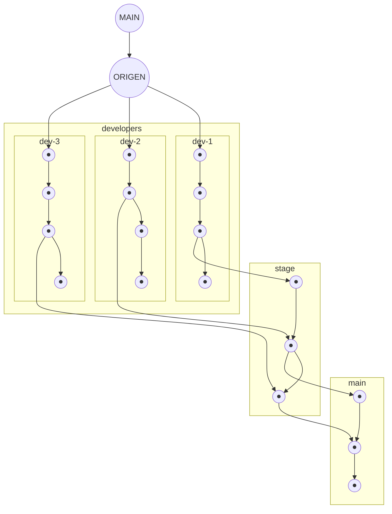

# Guía de contribución

Esta guía de contribución contiene las especificaciones para el uso de **Git**. Incluye en detalle el flujo de trabajo que se maneja, la función de las ramas y el uso de comandos.

Además, se incluye una guía para el manejo de la documentación del proyecto.

## Índice

<details>
<summary><a href="#title1">1. Configuración de cuenta de Git</a></summary>

* Recomedación del manejo de una cuenta de git, priorizando las configuraciones locales.

</details>

<details>
<summary><a href="#title2">2. Ramas del proyecto</a></summary>

* Explicación de la función de cada rama y una breve intoducción al manejo de elas.

</details>

<details>
<summary><a href="#title3">3. Flujo de trabajo diario</a></summary>

* Los comandos y el flujo de trabajo que maneja cada contribuidor y el grupo
  en general, siendo un flujo rápido, limpio y sin agujeros.

</details>

<details>
<summary><a href="#title4">4. Resolver un conflicto de merge</a></summary>

* Se detalla como resolver un conflicto al hacer merge entre commits
  (commit antiguo --> rama stage y commit actual --> rama actual), solo
  se involucra stage y una rama dev, nunca se involucra main.

</details>

<details>
<summary><a href="#title5">5. Nomenclatura de commits y rama</a></summary>

* La nomenclatura a manejar para los títulos de ramas y commits

</details>

<details>
<summary><a href="#title6">6. Documentación del proyecto</a></summary>

*

</details>

---

<details open>
<summary><h2 id="title1">1. Configuración de cuenta de Git</h2></summary>

Tener una cuenta de Git correctamente configurada es esencial. **Está prohibido cambiar el correo electrónico o el usuario de la configuración global de Git** para cualquiera de los espacios de trabajo utilizados con el repositorio (laptop, desktop, PC, VM, Sandbox, directorio, workspace, environment, etc.).

Para evitar estos problemas, se recomienda utilizar una **configuración local**, de modo que la cuenta de Git pueda configurarse específicamente para cada repositorio o espacio de trabajo.

> [!IMPORTANT]
>
> Si configuras una cuenta de Git a nivel local, esta tendrá prioridad sobre las configuraciones globales y de sistema.
>
> **Prioridad:** `local > global > system`

<details>
<summary>Configurar cuenta de Git</summary>

### Configuración local — recomendada

**Usuario:**

```bash
git config user.name "kebab-case"
```

**Correo:**

```bash
git config user.email "user@gmail.com"
```

### Configuración global

> [!WARNING]
>
> No se recomienda utilizar esta configuración para este proyecto, ya que puede afectar a otros repositorios.

**Usuario:**

```bash
git config --global user.name "kebab-case"
```

**Correo:**

```bash
git config --global user.email "user@gmail.com"
```

</details>

</details>

---

<details open>
<summary><h2 id="title2">2. Ramas del proyecto</h2></summary>

Para garantizar la integridad del proyecto, se han creado dos ramas principales de trabajo, a las que se suman las ramas de los contribuidores.

Trabajar con varias ramas en Git puede parecer complicado. Sin embargo, siguiendo correctamente las normas establecidas, se garantiza que, incluso si se acepta un Pull Request innecesario, exista una rama previa a `main` que permita revisar o revertir los cambios.



### `main`

La rama `main` contiene el código considerado estable del proyecto.

No se debe trabajar directamente sobre esta rama.

### `stage`

La rama `stage` funciona como puente entre las ramas de desarrollo y `main`.

Su objetivo es proporcionar una rama previa a `main` donde se puedan revisar y validar los cambios antes de incorporarlos a la rama principal.

Los cambios provenientes de una rama de desarrollo deben llegar a `stage` mediante un **Pull Request**.

Una vez que los cambios hayan sido revisados y aprobados por los miembros del proyecto, `stage` podrá incorporarse a `main` mediante otro **Pull Request**.

> [!WARNING]
>
> Está prohibido enviar un Pull Request directamente desde una rama de desarrollo hacia `main` o realizar `push` directamente sobre `main`, incluso si se es el propietario del repositorio.
>
> El incumplimiento de esta norma será sancionado de acuerdo con las reglas del proyecto.

### Ramas de desarrollo

Las ramas de desarrollo se utilizan para implementar cambios específicos.

Cada contribuidor debe trabajar sobre su propia rama de desarrollo y seguir la nomenclatura establecida en esta guía.

> [!IMPORTANT]
>
> Se debe mantener una única rama de desarrollo activa por contribuidor para evitar problemas de sincronización con `stage`.

</details>

---

<details open>
<summary><h2 id="title3">3. Flujo de trabajo diario</h2></summary>

Los conflictos de merge pueden aparecer durante el desarrollo, especialmente cuando varios contribuidores modifican partes relacionadas del proyecto. Un flujo de trabajo ordenado ayuda a reducir su aparición y facilita su resolución.

### 1. Actualizar las ramas locales

Antes de comenzar a trabajar, actualiza las ramas `main` y `stage` respecto al repositorio remoto:

```bash
git switch main
git pull origin main

git switch stage
git pull origin stage
```

### 2. Crear una rama de desarrollo

Crea una nueva rama a partir de `stage` y cambia a ella.

El nombre debe utilizar **kebab-case** y seguir la nomenclatura establecida en esta guía.

```bash
git switch stage
git switch -c "categoría/propósito"
```

Por ejemplo:

```bash
git switch -c "fix/corregir-validacion"
```

### 3. Realizar los cambios

Realiza los cambios necesarios dentro de la rama de desarrollo.

### 4. Preparar los cambios

Una vez finalizado el trabajo, agrega los archivos al área de staging:

```bash
git add .
```

### 5. Crear el commit

Crea un commit siguiendo la nomenclatura establecida:

```bash
git commit -m "categoría: problema tratado"
```

### 6. Subir la rama al repositorio

Sube la rama al repositorio remoto:

```bash
git push -u origin [rama]
```

### 7. Crear el Pull Request hacia `stage`

Desde GitHub, crea un Pull Request desde tu rama de desarrollo hacia `stage`.

Evita generar una gran cantidad de commits innecesarios antes del Pull Request, ya que esto dificulta la revisión y puede aumentar el tiempo necesario para realizar correcciones.


### 8. Revisión en `stage`

Una vez creado el Pull Request, los cambios serán revisados por los miembros del proyecto.

Si aparecen conflictos de merge, deberán resolverse antes de completar el Pull Request.

### 9. Pull Request de `stage` hacia `main`

Una vez que los cambios hayan sido aprobados e integrados en `stage`, se podrá realizar un Pull Request desde `stage` hacia `main`.

La aprobación final de este Pull Request corresponde al propietario del repositorio.

### 10. Eliminar la rama de desarrollo

Una vez completado el trabajo, cambia a `stage` y elimina la rama de desarrollo local:

```bash
git switch stage
git branch -d [rama]
```

> [!IMPORTANT]
>
> Nunca elimines una rama mientras estés situado sobre ella.

</details>

---

<details open>
<summary><h2 id="title4">4. Resolver un conflicto de merge</h2></summary>

Los conflictos de merge es probablemente la característica más molesta, pero con los cuidados correctos, son una de las maravillas dentro del software.

Dentro del repositorio, los merge conflicts pueden darse en stage, más no en main, siempre y cuando el administrador no haga push directo a main,
ya que al momento de hacer un pull request desde stage, los merge conflicts aparece.

Sí se presenta un merge conflict, la decisión se debate entre el autor del anterior commit y el actual (obviamente después de que se haya aprovado la inclusión del commit en stage),
teniendo en cuenta los siguientes parámetros:
- si es el mismo autor, el tiene total protestad sobre la resolución del los conflicts.
- en caso de no llegar a un acuerdo, el tercer contribuidor tiene la decisión final.
- en caso de que exista la ausencia del voto del tercer contribuidor, el anterior commit tiene prioridad sobre el actual.

</details>

---

<details open>
<summary><h2 id="title5">5. Nomenclatura de commits y ramas</h2></summary>

La nomenclatura permite identificar rápidamente el propósito de una rama o commit.

Tanto los commits como las ramas deben utilizar el siguiente formato:

```text
categoría/propósito
```

A continuación, las categorías que pueden llegar a main:

```text
feature/agregar-característica
feat/agregar-validación
fix/corregir-función
docs/actualizar-guia
refactor/simplificar-función
```

Solo se puede nombrar así a un commit, ya que este se crea desde stage, y debe ser autorizado por todo el equipo:

```text
hotfix/corregir-en-caliente 
```

Commit preparado para una versión/lanzamiento oficial, debe ser autorizado por el equipo entero:

```text
release/v11.00
```

Solo se puede nombrar así a una rama, que será trabajada en local con fines de experimentación, pero que no puede subirse a stage:

```text
experiment/local-changes
```

</details>

---

<details open>
<summary><h2 id="title6">6. Documentación del proyecto</h2></summary>

>[!NOTE]
>
> Pendiente de documentación.

</details>

